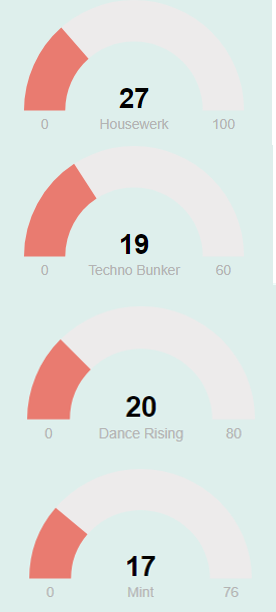

```{r setup, include=FALSE}
library(flexdashboard)
library(tidyverse)
library(spotifyr)
library(dplyr)
library(ggplot2)
library(compmus) 
library(plotly)
```

```{r, include=FALSE}
housewerk <- get_playlist_audio_features("", "37i9dQZF1DXa8NOEUWPn9W")
technobunker <- get_playlist_audio_features("", "37i9dQZF1DX6J5NfMJS675")
dance_rising <- get_playlist_audio_features("", "37i9dQZF1DX8tZsk68tuDw")
mint <- get_playlist_audio_features("", "37i9dQZF1DX4dyzvuaRJ0n")

housewerk <- housewerk |>
  mutate(number_order = row_number())
technobunker <- technobunker |>
  mutate(number_order = row_number())
dance_rising <- dance_rising |>
  mutate(number_order = row_number())
mint <- mint |>
  mutate(number_order = row_number())

all_data <- bind_rows(housewerk, technobunker, dance_rising, mint)
```


Introduction {data-icon="ion-ios-home"}
=======================================================
```{r, include=FALSE}
housewerk <- get_playlist_audio_features("", "37i9dQZF1DXa8NOEUWPn9W")
technobunker <- get_playlist_audio_features("", "37i9dQZF1DX6J5NfMJS675")
dance_rising <- get_playlist_audio_features("", "37i9dQZF1DX8tZsk68tuDw")
mint <- get_playlist_audio_features("", "37i9dQZF1DX4dyzvuaRJ0n")

housewerk <- housewerk |>
  mutate(number_order = row_number())
technobunker <- technobunker |>
  mutate(number_order = row_number())
dance_rising <- dance_rising |>
  mutate(number_order = row_number())
mint <- mint |>
  mutate(number_order = row_number())

all_data <- bind_rows(housewerk, technobunker, dance_rising, mint)
```

Row {data-height=200}
-----------------------------------------------------------------------
### Valuebox

```{r}
valueBox(nrow(housewerk), caption = 'Number of TechHouse songs in the playlist Houswerk', icon="ion-music-note")
```

### Valuebox
```{r}
valueBox(nrow(technobunker), caption = 'Number of Techno songs in the playlist Technobunker', icon="ion-music-note")
```

### Valuebox
```{r}
valueBox(nrow(dance_rising), caption = 'Number of DancePop songs in the playlist Dance Rising', icon="ion-music-note")
```

### Valuebox
```{r}
valueBox(nrow(mint), caption = 'Number of DancePop songs in the playlist Mint', icon="ion-music-note")
```

Row {data-height=250} 
-----------------------------------------------------------------------
<iframe style="border-radius:12px" src="https://open.spotify.com/embed/playlist/37i9dQZF1DXa8NOEUWPn9W?utm_source=generator" width="25%" height="100" frameBorder="0" allowtransparency="true" allow="encrypted-media" data-external="1"></iframe>

<iframe style="border-radius:12px" src="https://open.spotify.com/embed/playlist/37i9dQZF1DX6J5NfMJS675?utm_source=generator" width="25%" height="100" frameBorder="0" allowtransparency="true" allow="encrypted-media" data-external="1"></iframe>

<iframe style="border-radius:12px" src="https://open.spotify.com/embed/playlist/37i9dQZF1DX8tZsk68tuDw?utm_source=generator" width="25%" height="100" frameBorder="0" allowtransparency="true" allow="encrypted-media" data-external="1"></iframe>

<iframe style="border-radius:12px" src=https://open.spotify.com/embed/playlist/37i9dQZF1DX4dyzvuaRJ0n?utm_source=generator" width="25%" height="100" frameBorder="0" allowtransparency="true" allow="encrypted-media" data-external="1"></iframe>

Row {data-height=1000}
-------------------------------------------------------------------------
### Introduction
This portfolio looks at the relationship between Spotify's Automix functionality and the musical corresponding mix components used in the DJ industry to smoothly transition songs. The automix playlists used for this portfolio are HouseWerk, TechnoBunker, Mint and Dance Rising. The music contained in the playlist is best classified under House music. In subcategory the Housewerk playlist contains techhouse, TechnoBunker techno, DanceRising and Mint dance pop. The interest in this comparison came from being a DJ myself. In the DJ world, mainly 2 components are used that are important for a transition between two songs. These are the tempo of the songs and the pitch (key) that the mixing songs are in. It will be investigated whether these components are also used by the automix functionality. This will focus on the order of the songs in the playlist. The shuffle functionality will be left out.  It may also turn out that the functionality is completely random. Looking at the HouseWerk playlist, the first analysis can be made of the songs that are in the playlist. What is immediately noticeable is that the songs occur mostly in the same tempo range. This is a tempo between 125 and 130 bpm (beats per minute). About the key, at first glance, it is difficult to make a statement. In general, tech house songs are mostly made in A minor. This makes overmixing in the same key easy. Later analysis will show whether the order of the songs in the playlist was determined explicitly in order to achieve a good transition.

### How to mix two songs together? 
Test

Tempo {data-navmenu="Important musical elements for analysis" data-icon="ion-ios-speedometer" .storyboard}
=======================================================
### Tempo of the songs in the playlist
```{r}
#Boxplot
tempoplot <-ggplot(all_data, aes(x = playlist_name, y = tempo, color = playlist_name)) + 
  geom_boxplot() + 
  labs(title = "Tempo of the songs in the playlists", 
       x = "Playlist Name",
       y = "Tempo (Beats per minute)", 
       caption = "Portfolio Laurens Krook (13176439)") + 
  theme(legend.position = "None")
ggplotly(tempoplot)
```

***
The first visualization shows the distribution over tempo of the songs within the different playlists. In the visualization below, the x axis shows the different playlists. On the y axis, the tempo is visible. If we look closely at the visualization we see that the playlist Technobunker has a high median compared to the other playlists. There are also the fewest outliers here compared to the other playlists. The spread of Housewerk is the smallest. This means that the tempo in this playlist is mostly close to the median. This is a positive first analysis on the research question.

### Tempo of the songs in order of playlists
```{r}
ggplot(all_data, aes(x = number_order, y= tempo, color = playlist_name)) + 
  geom_line() +
  facet_wrap(vars(playlist_name), ncol = 4, scales = "free_x") + 
  labs(title = "Tempo of the songs in order of playlists", 
       x = "Track Number", 
       y = "Tempo (in beats per minute)",
       caption = "Portfolio Laurens Krook (13176439)") + 
  theme(legend.position = "None")
```

***
The second visualization shows the progression of tempo over the playlist. On the x axis here the songs are numerically represented in playlist order. On the y axis, the tempo is shown. Also in this visualization it is noticeable that the playlists Housewerk and Technobunker have a better distribution of tempo compared to Dance Rising and Mint. In the latter playlists, the tempo is more dispersed.

### Tempogram {data-commentary-width=400}
```{r}
affraid_to_feel <- get_tidy_audio_analysis("40SBS57su9xLiE1WqkXOVr")
affraid_to_feel |>
  tempogram(window_size = 8, hop_size = 1, cyclic = TRUE) |>
  ggplot(aes(x = time, y = bpm, fill = power)) +
  geom_raster() +
  scale_fill_viridis_c(guide = "none") +
  labs(x = "Time (s)", y = "Tempo (BPM)", title = "LF SYSTEMS - Afraid to Feel") +
  theme_classic()
```

***
In the DJ world, the easiest method to mix two songs is to keep the tempo the same throughout the song. When this is not the case, it requires an advanced technique to mix the songs together. The tempo analysis features in the turntable are now no longer accurate because this currently gives an average value of the tempo over time rather than the tempo per section in the song. The DJ must be familiar with this change in tempo in order to mix the song correctly. An example of an outlier in the corpus is the song [Affraid to Feel by LF SYSTEM](https://open.spotify.com/track/40SBS57su9xLiE1WqkXOVr?si=3aa011c350324fad). The song was released on May 2, 2022. The song uses the sample from the song [I Can't Stop (Turning You On) by SILK](https://open.spotify.com/track/6la3A2IUZcuIH5tXOQWqxL?si=db8bfd669fd24641). This song has a tempo of 85 bpm. So for LF SYSTEM it was a challenge to incorporate the sample into a disco track with a tempo of 130 BPM. This is evident from the tempogram. The song starts slowly with a tempo of 100 BPM. After 20 seconds, the tempo increases to 130 BPM. This is when song switches from the intro to the chorus. What is not immediately clear is that after the chorus, the tempo drops slightly. After repeated listens, this became audible. From the tempogram it can be seen that after the first chorus, the chorus returns 2 more times. The last thing that stands out is that after about 150 seconds the tempo is classified as rapidly increasing. In the recording it can be heard that the kick drum changes from every four-quarter measure to every 8th measure. This makes the tempo seem to double but is not actually the case. It is the lead-up to the chorus. I myself tried to follow the tempo. See the video below for this. 

<video width="320" height="170" controls>
  <source src="VideoTap.mp4" type="video/mp4">
</video>


Key {data-navmenu="Important musical elements for analysis" data-icon="ion-key" .storyboard}
=======================================================
Row {.sidebar}
-----------------------------------------------------------------------

```{r, include=FALSE}
house_werk_key_count <- housewerk %>%
  mutate(diff = abs(key - lag(key))) %>% 
  filter(!is.na(diff) & diff <= 1) %>%
  summarise(n())

housewerk_key_count_value <- house_werk_key_count[[1,1]]
gauge(housewerk_key_count_value, min = 0, max = 100,  
  label = "Housewerk", gaugeSectors(
  success = c(80, 100), warning = c(40, 79), danger = c(0, 39)
))
technobunker_key_count <- technobunker %>%
  mutate(diff = abs(key - lag(key))) %>% 
  filter(!is.na(diff) & diff <= 1) %>%
  summarise(n())

technobunker_key_count_value <- technobunker_key_count[[1,1]]
gauge(technobunker_key_count_value, min = 0, max = 60,  
  label = "Techno Bunker", gaugeSectors(
  success = c(41, 60), warning = c(21, 40), danger = c(0, 20)
))

dance_rising_key_count <- dance_rising %>%
  mutate(diff = abs(key - lag(key))) %>% 
  filter(!is.na(diff) & diff <= 1) %>%
  summarise(n())

dance_rising_key_count_value <- dance_rising_key_count[[1,1]]
gauge(dance_rising_key_count_value, min = 0, max = 80,  
  label = "Dance Rising", gaugeSectors(
  success = c(54, 80), warning = c(27, 53), danger = c(0, 26)
))
mint_key_count <- mint %>%
  mutate(diff = abs(key - lag(key))) %>% 
  filter(!is.na(diff) & diff <= 1) %>%
  summarise(n())

mint_key_count_value <- mint_key_count[[1,1]]
gauge(mint_key_count_value, min = 0, max = 76,  
  label = "Mint", gaugeSectors(
  success = c(51, 76), warning = c(26, 50), danger = c(0, 25)
))
```

> Count songs mixed correctly

### Good Transition
```{r, echo=FALSE}
circshift <- function(v, n) {
  if (n == 0) v else c(tail(v, n), head(v, -n))
}

#      C     C#    D     Eb    E     F     F#    G     Ab    A     Bb    B
major_chord <-
  c(   1,    0,    0,    0,    1,    0,    0,    1,    0,    0,    0,    0)
minor_chord <-
  c(   1,    0,    0,    1,    0,    0,    0,    1,    0,    0,    0,    0)
seventh_chord <-
  c(   1,    0,    0,    0,    1,    0,    0,    1,    0,    0,    1,    0)

major_key <-
  c(6.35, 2.23, 3.48, 2.33, 4.38, 4.09, 2.52, 5.19, 2.39, 3.66, 2.29, 2.88)
minor_key <-
  c(6.33, 2.68, 3.52, 5.38, 2.60, 3.53, 2.54, 4.75, 3.98, 2.69, 3.34, 3.17)

chord_templates <-
  tribble(
    ~name, ~template,
    "Gb:7", circshift(seventh_chord, 6),
    "Gb:maj", circshift(major_chord, 6),
    "Bb:min", circshift(minor_chord, 10),
    "Db:maj", circshift(major_chord, 1),
    "F:min", circshift(minor_chord, 5),
    "Ab:7", circshift(seventh_chord, 8),
    "Ab:maj", circshift(major_chord, 8),
    "C:min", circshift(minor_chord, 0),
    "Eb:7", circshift(seventh_chord, 3),
    "Eb:maj", circshift(major_chord, 3),
    "G:min", circshift(minor_chord, 7),
    "Bb:7", circshift(seventh_chord, 10),
    "Bb:maj", circshift(major_chord, 10),
    "D:min", circshift(minor_chord, 2),
    "F:7", circshift(seventh_chord, 5),
    "F:maj", circshift(major_chord, 5),
    "A:min", circshift(minor_chord, 9),
    "C:7", circshift(seventh_chord, 0),
    "C:maj", circshift(major_chord, 0),
    "E:min", circshift(minor_chord, 4),
    "G:7", circshift(seventh_chord, 7),
    "G:maj", circshift(major_chord, 7),
    "B:min", circshift(minor_chord, 11),
    "D:7", circshift(seventh_chord, 2),
    "D:maj", circshift(major_chord, 2),
    "F#:min", circshift(minor_chord, 6),
    "A:7", circshift(seventh_chord, 9),
    "A:maj", circshift(major_chord, 9),
    "C#:min", circshift(minor_chord, 1),
    "E:7", circshift(seventh_chord, 4),
    "E:maj", circshift(major_chord, 4),
    "G#:min", circshift(minor_chord, 8),
    "B:7", circshift(seventh_chord, 11),
    "B:maj", circshift(major_chord, 11),
    "D#:min", circshift(minor_chord, 3)
  )
key_templates <-
  tribble(
    ~name, ~template,
    "Gb:maj", circshift(major_key, 6),
    "Bb:min", circshift(minor_key, 10),
    "Db:maj", circshift(major_key, 1),
    "F:min", circshift(minor_key, 5),
    "Ab:maj", circshift(major_key, 8),
    "C:min", circshift(minor_key, 0),
    "Eb:maj", circshift(major_key, 3),
    "G:min", circshift(minor_key, 7),
    "Bb:maj", circshift(major_key, 10),
    "D:min", circshift(minor_key, 2),
    "F:maj", circshift(major_key, 5),
    "A:min", circshift(minor_key, 9),
    "C:maj", circshift(major_key, 0),
    "E:min", circshift(minor_key, 4),
    "G:maj", circshift(major_key, 7),
    "B:min", circshift(minor_key, 11),
    "D:maj", circshift(major_key, 2),
    "F#:min", circshift(minor_key, 6),
    "A:maj", circshift(major_key, 9),
    "C#:min", circshift(minor_key, 1),
    "E:maj", circshift(major_key, 4),
    "G#:min", circshift(minor_key, 8),
    "B:maj", circshift(major_key, 11),
    "D#:min", circshift(minor_key, 3)
  )
```

```{r, echo = FALSE}
par(mfrow = c(1,2))

get_tidy_audio_analysis("7udjTmsTZqdB1xLOHGJ8dM") |>
  compmus_align(sections, segments) |>
  select(sections) |>
  unnest(sections) |>
  mutate(
    pitches =
      map(segments,
        compmus_summarise, pitches,
        method = "mean", norm = "manhattan"
      )
  ) |> 
  compmus_match_pitch_template(key_templates, "euclidean", "manhattan") |>
  ggplot(
    aes(x = start + duration / 2, width = duration, y = name, fill = d)
  ) +
  geom_tile() +
  scale_fill_viridis_c(guide = "none") +
  theme_minimal() +
  labs(x = "Time (s)", y = "", title = "Jengi - Bel Mercy")

get_tidy_audio_analysis("6KCmJ8VI6VYNRNubSqi0Ck") |>
  compmus_align(sections, segments) |>
  select(sections) |>
  unnest(sections) |>
  mutate(
    pitches =
      map(segments,
        compmus_summarise, pitches,
        method = "mean", norm = "manhattan"
      )
  ) |> 
  compmus_match_pitch_template(key_templates, "cosine", "euclidean") |>
  ggplot(
    aes(x = start + duration / 2, width = duration, y = name, fill = d)
  ) +
  geom_tile() +
  scale_fill_viridis_c(guide = "none") +
  theme_minimal() +
  labs(x = "Time (s)", y = "", title = "ESSEL - Lennon")
```

>For this portfolio, it is necessary to look at the interrelationship between the songs within the playlist. This can be used to find out if spotify uses the "mix in key" technique. For this analysis, 2 songs were used. The first song is the song Bel Mercy written by Jengi. The second song used is Lennon written by ESSEL. The relationship in terms of key between the songs is compared in this storyboard page. Starting with Bel Mercy, it is visible that this song is written in C#m. What also stands out in the visualization is the yellow vertical bar. This is created by the drums that can be heard in the foreground after 25 seconds. These are not audible earlier in the song. Looking at the second song, we see that it is written in F#m. With the circle of fifth's knowledge in mind, we know that a good transition can be made between C#m and F#m. This transition in the playlist can be considered a good transition. 

### Bad Transition
```{r, echo = FALSE}
par(mfrow = c(1,2))

get_tidy_audio_analysis("5mKiwDDrwG22qKKVL6JZqF") |>
  compmus_align(sections, segments) |>
  select(sections) |>
  unnest(sections) |>
  mutate(
    pitches =
      map(segments,
        compmus_summarise, pitches,
        method = "mean", norm = "manhattan"
      )
  ) |> 
  compmus_match_pitch_template(key_templates, "cosine", "euclidean") |>
  ggplot(
    aes(x = start + duration / 2, width = duration, y = name, fill = d)
  ) +
  geom_tile() +
  scale_fill_viridis_c(guide = "none") +
  theme_minimal() +
  labs(x = "Time (s)", y = "", title = "MK, Dom Dolla - Rhyme Dust")

get_tidy_audio_analysis("1ZNaOGKAZKaZh7V87zDs1i") |>
  compmus_align(sections, segments) |>
  select(sections) |>
  unnest(sections) |>
  mutate(
    pitches =
      map(segments,
        compmus_summarise, pitches,
        method = "mean", norm = "manhattan"
      )
  ) |> 
  compmus_match_pitch_template(key_templates, "cosine", "euclidean") |>
  ggplot(
    aes(x = start + duration / 2, width = duration, y = name, fill = d)
  ) +
  geom_tile() +
  scale_fill_viridis_c(guide = "none") +
  theme_minimal() +
  labs(x = "Time (s)", y = "", title = "Jess Bays, Harley May - Colourblind")
```

>Looking at a bad transition, two songs were used here as well.  The first song is the song Rhyme Dust written by MK and Dom Dolla. The second song used is Colourblind written by Jess Bays and Harley May. Looking at the first song we see Cm and G major very dark. A very slight difference. In my opinion the G major is slightly darker anyway which is probably why this song was written in this pitch. Again, after about 130 seconds we see a vertical yellow bar. Less obvious as in the song Bel Mercy but still it can be distinguished. Also in this song we see that this is caused by the the drums, more specifically the kick drum. Looking at the second song we see that C# minus is very dark. With our knowledge of the circle of fifth's and fourth's in mind, we see that this is not a good transition.

### Number of songs with same key
```{r}
keys_housewerk <- housewerk |>
  count(key) |>
  mutate(playlist_name = "housewerk")
keys_technobunker <- technobunker |>
  count(key) |>
  mutate(playlist_name = "technobunker")
keys_dance_rising <- dance_rising |>
  count(key) |>
  mutate(playlist_name = "dance_rising")
keys_mint <- mint |>
  count(key) |>
  mutate(playlist_name = "mint")

all_keys = bind_rows(keys_housewerk, keys_technobunker, keys_dance_rising, keys_mint)
ggplot(all_keys, aes(x = str_wrap(key, 5), y = n, fill = n)) + 
  geom_col() +
  scale_fill_gradient(low="red", high="green") +
  facet_wrap(vars(playlist_name), ncol = 4) + 
  coord_polar() + 
  labs(title = "Number of songs with same key",
       x = "Playlist name",
       caption = "Portfolio Laurens Krook (13176439)")
```

>This visualization shows the pitch of the different songs. The reason this visualization was chosen is because it is important for DJs to observe pitch when mixing songs. The outer ring shows the keys. The color and deflection of the bars shows the number of songs in this key. If the visualization shows that the songs have an even distribution across the key, this may mean that the key is observed when songs are mixed. In the visualization this can be clearly seen with the playlists Mint and Housewerk.

Chromograms {data-navmenu="Important musical elements for analysis" data-icon="ion-music-note"}
=======================================================
```{r}
first_song <-
  get_tidy_audio_analysis("65nn7e1DOFh5MRHHQ7GWBi") |>
  select(segments) |>
  unnest(segments) |>
  select(start, duration, pitches)

second_song <-
  get_tidy_audio_analysis("15223sfwoQj4IAJL8GSnfO") |>
  select(segments) |>
  unnest(segments) |>
  select(start, duration, pitches)

```

Row {.tabset}
-----------------------------------------------------------------------
### First song Housewerk
```{r}
first_song |>
  mutate(pitches = map(pitches, compmus_normalise, "chebyshev")) |>
  compmus_gather_chroma() |> 
  ggplot(
    aes(
      x = start + duration / 2,
      width = duration,
      y = pitch_class,
      fill = value
    )
  ) +
  geom_tile() +
  labs(x = "Time (s)", y = NULL, fill = "Magnitude", title = "Häwk, Beyge - No Diggity") +
  theme_minimal() +
  scale_fill_viridis_c()
```

>In this section, we chose to compare two songs from the playlist Housewerk. The songs chosen are listed in order in the playlist. This is to see if it becomes clear if certain chords are used in the songs that go well together. This makes the transition between the songs sound better. Starting with the first track, the song No Diggity produced by Häwk and Beyge was chosen. The song is a cover of of the original song written by Blackstreet, Dr. Dre and Queen Pan that was released in 1996. The song is played primarily in C# and F#. Chebyshev was chosen as the normalization. This is because with the euclidean and manhattan it was not clearly visible which notes were used.The second song analyzed is the song Ritmo by Raffa FL. It is a cover of the song La Colegiala by The Boy Next Door, Fresh Coast and Jody Bernal. From the chromogram, we notice that the song is played in F, G and Gm. Euclidean was chosen as the normalization. This is because with this method the magnitude (in yellow) was the clearest. With confirmation from the spotify API, it is clear that these two songs can be well mixed together. 

### Second song Housewerk
```{r}
second_song |>
  mutate(pitches = map(pitches, compmus_normalise, "euclidean")) |>
  compmus_gather_chroma() |> 
  ggplot(
    aes(
      x = start + duration / 2,
      width = duration,
      y = pitch_class,
      fill = value
    )
  ) +
  geom_tile() +
  labs(x = "Time (s)", y = NULL, fill = "Magnitude", title = "Raffa Fl - Ritmo") +
  theme_minimal() +
  scale_fill_viridis_c()
```

>In this section, we chose to compare two songs from the playlist Housewerk. The songs chosen are listed in order in the playlist. This is to see if it becomes clear if certain chords are used in the songs that go well together. This makes the transition between the songs sound better. Starting with the first track, the song No Diggity produced by Häwk and Beyge was chosen. The song is a cover of of the original song written by Blackstreet, Dr. Dre and Queen Pan that was released in 1996. The song is played primarily in C# and F#. Chebyshev was chosen as the normalization. This is because with the euclidean and manhattan it was not clearly visible which notes were used.The second song analyzed is the song Ritmo by Raffa FL. It is a cover of the song La Colegiala by The Boy Next Door, Fresh Coast and Jody Bernal. From the chromogram, we notice that the song is played in F, G and Gm. Euclidean was chosen as the normalization. This is because with this method the magnitude (in yellow) was the clearest. With confirmation from the spotify API, it is clear that these two songs can be well mixed together. 

Similarity Matrix {data-navmenu="Important musical elements for analysis" data-icon="ion-android-contacts" .storyboard}
=========================================================
### La Fuente - I Want You
```{r}
bzt <-
  get_tidy_audio_analysis("4s8BpmFtxDgeCoPj2XHtVj") |>
  compmus_align(bars, segments) |>
  select(bars) |>
  unnest(bars) |>
  mutate(
    pitches =
      map(segments,
        compmus_summarise, pitches,
        method = "acentre", norm = "manhattan"
      )
  ) |>
  mutate(
    timbre =
      map(segments,
        compmus_summarise, timbre,
        method = "mean"
      )
  )
bind_rows(
  bzt |> 
    compmus_self_similarity(pitches, "aitchison") |> 
    mutate(d = d / max(d), type = "Chroma"),
  bzt |> 
    compmus_self_similarity(timbre, "euclidean") |> 
    mutate(d = d / max(d), type = "Timbre")
) |>
  mutate() |> 
  ggplot(
    aes(
      x = xstart + xduration / 2,
      width = xduration,
      y = ystart + yduration / 2,
      height = yduration,
      fill = d
    )
  ) +
  geom_tile() +
  coord_fixed() +
  facet_wrap(~type) +
  scale_fill_viridis_c(option = "E", guide = "none") +
  guides(fill = guide_legend(title = "Intensity")) +
  theme_classic() + 
  labs(x = "", y = "", title = "La Fuente - I Want You")
```

***
<iframe style="border-radius:12px" src="https://open.spotify.com/embed/track/4s8BpmFtxDgeCoPj2XHtVj?utm_source=generator" width="100%" height="152" frameBorder="0" allowtransparency="true" allow="encrypted-media" data-external="1"></iframe>
Above are the similairty matrices of the chroma features (left) and timbre (right). The song chosen is La Fuente - I Want You. The song is in key 8, the tempo is 125 bpm and energy is 0.8. We analyze the figure using 3 criteria. Representation (shows the repeating elements with diagonal sloping lines), novelty (bright yellow lines when a part is not similar and dark lines when it is) and lastly homogeneity (A so-called chessboard that when it is dark blue shows that everything is similar and when it is more yellow more difference). Starting with the representation, it is difficult to find the diagonal lines. They can be seen very slightly at the end of the song Looking at the novelty, it is clear that the song has 2 refrains. These are the intersections of the yellow lines around 40 and 190 seconds. At that point the song changes tremendously. Looking last at the homogeneity, the chessboards are mainly found between 50 and 100 seconds. 


### Tom Santa - Rainfall
```{r}
bzt <-
  get_tidy_audio_analysis("1M8t1j3Kv2qp97bdq5q4Vl") |>
  compmus_align(bars, segments) |>
  select(bars) |>
  unnest(bars) |>
  mutate(
    pitches =
      map(segments,
        compmus_summarise, pitches,
        method = "acentre", norm = "manhattan"
      )
  ) |>
  mutate(
    timbre =
      map(segments,
        compmus_summarise, timbre,
        method = "mean"
      )
  )
bind_rows(
  bzt |> 
    compmus_self_similarity(pitches, "aitchison") |> 
    mutate(d = d / max(d), type = "Chroma"),
  bzt |> 
    compmus_self_similarity(timbre, "euclidean") |> 
    mutate(d = d / max(d), type = "Timbre")
) |>
  mutate() |> 
  ggplot(
    aes(
      x = xstart + xduration / 2,
      width = xduration,
      y = ystart + yduration / 2,
      height = yduration,
      fill = d
    )
  ) +
  geom_tile() +
  coord_fixed() +
  facet_wrap(~type) +
  scale_fill_viridis_c(option = "E", guide = "none") +
  guides(fill = guide_legend(title = "Intensity")) + 
  theme_classic() + 
  labs(x = "", y = "", title = "Tom Santa - Rainfall")
```

***
<iframe style="border-radius:12px" src="https://open.spotify.com/embed/track/1M8t1j3Kv2qp97bdq5q4Vl?utm_source=generator" width="100%" height="152" frameBorder="0" allowtransparency="true" allow="encrypted-media" data-external="1"></iframe>
Looking at the second song, we look at the analysis of the song Tom Santa - Rainfall. This is a cover of the song Shackles released by Mary Mary. The song is in key 5, the tempo is 128 bpm and the energy is almost 0.9. Like the song by La Fuente, I analyze this song using the 3 characteristics of representation, novelty and homogeneity. Starting with representation, we see the diagonal dark lines a lot in the song. During the beginning of the song until 30 seconds it is clearly visible. Looking at the novelty, a large intersection can be found around 90 seconds. You can clearly hear the transition in the song. Lastly looking at the homogeneity, the chess boards are also well found in this song. Especially some smaller chessboards between 25 and 90 seconds. Because these are dark blue chessboards, the song changes a lot in this time interval

